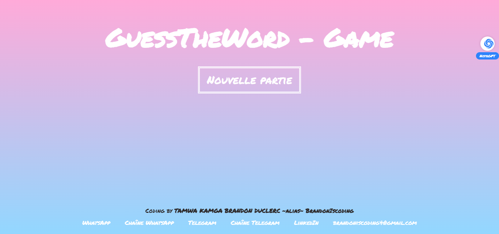
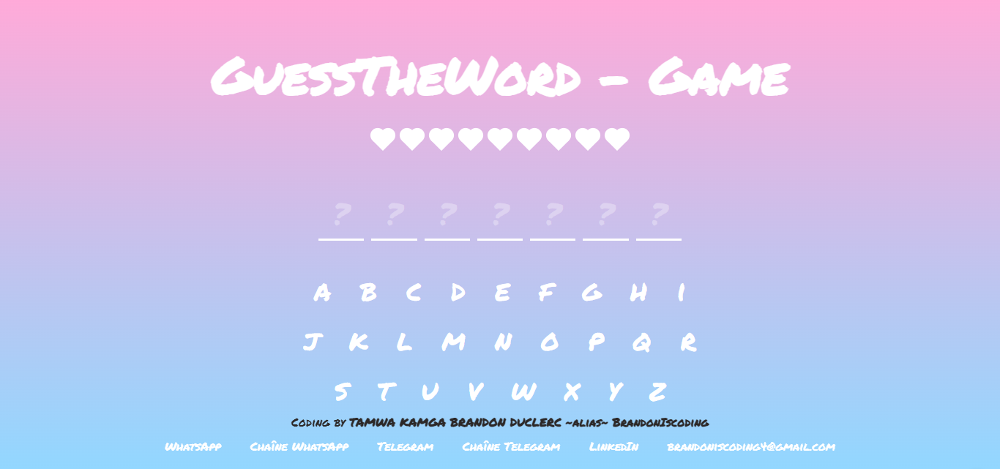

# GuessWhat - Jeu de devinette de mots en React

GuessWhat est un jeu de devinette de mots simple réalisé en utilisant React. Le jeu consiste à deviner un mot en saisissant une lettre à la fois. Chaque fois qu'une lettre est devinée correctement, elle est affichée dans le mot. Le joueur gagne s'il parvient à deviner le mot avant d'avoir fait un nombre maximum d'erreurs.

Ce projet a été créé par TAMWA KAMGA BRANDON DUCLERC, également connu sous le pseudonyme BrandonIscoding, dans le cadre de son initiative "100 Projets 2024".

## Fonctionnalités

- Saisie d'une lettre pour deviner le mot
- Affichage du nombre d'erreurs restantes
- Message de victoire ou de défaite
- Bouton de réinitialisation pour recommencer le jeu

## Installation

1. Cloner le dépôt GitHub:
   ```bash
   git clone https://github.com/BrandonIscoding/GuessWhat.git
   ```

2. Installer les dépendances:
   ```bash
   cd GuessWhat
   npm install
   ```

3. Lancer l'application:
   ```bash
   npm start
   ```

## Technologies utilisées

- React
- HTML
- CSS

## Captures d'écran





## Auteur

TAMWA KAMGA BRANDON DUCLERC (BrandonIscoding)

## License

Ce projet est opensource, et ouverte a toute contribution!!!
