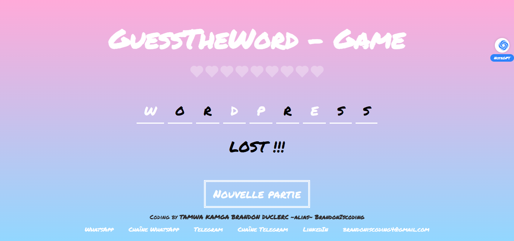

# guess-the-words - Word guessing game in React

GuessWhat is a simple word guessing game made using React. The game involves guessing a word by entering one letter at a time. Each time a letter is guessed correctly, it is displayed in the word. The player wins if he manages to guess the word before making a maximum number of mistakes.

## Features

- Enter a letter to guess the word
- Display of the number of remaining errors
- Victory or defeat message
- Reset button to start the game again

## Installation

1. Clone the GitHub repository:
   ```bash
   git clone https://github.com/BrandonIscoding/guess-the-words.git
   ```

2. Install dependencies:
   ```bash
   cd guess-the-words
   npm install
   ```

3. Launch the application:
   ```bash
   npm start
   ```

## Technologies used

- React
- HTML
- CSS

## Screenshot




## Author
This project was created by TAMWA KAMGA BRANDON DUCLERC, also known under the pseudonym BrandonIscoding, as part of his "100 Projects 2024" initiative.

For any questions or issues, please contact us at [brandoniscodin4g@email.com](mailto:brandoniscodin4@gmail.com@email.com).


## License

This project is opensource, and open to any contribution!!!
